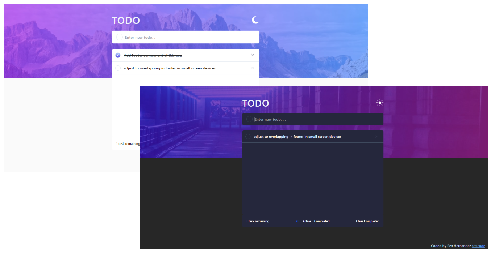

<h1 align="center">
  <a href="https://github.com/Rr-sobusy/todo-frontend-mentor">
 Todo App
  </a>
   
</h1>

**To-do App** is a frontend challenge by frontendmentor.io. Built this app using react typescript with the implementation of Context API x localStorage API. Can also reorder the list by drag and dropping the selected todo in designated y-position.

